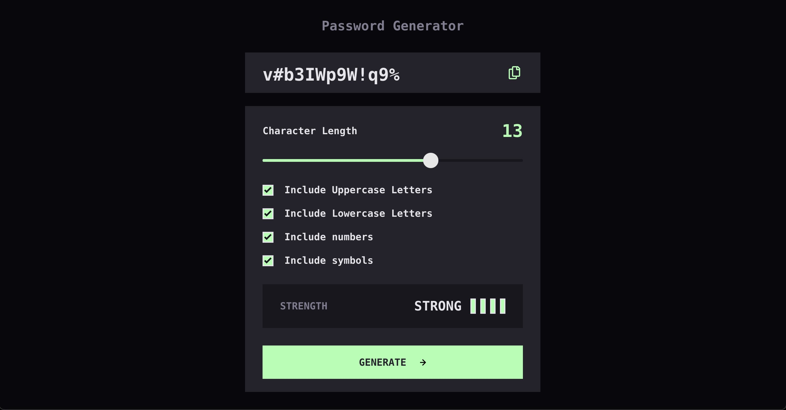

# Frontend Mentor - Password generator app solution

This is a solution to the [Password generator app challenge on Frontend Mentor](https://www.frontendmentor.io/challenges/password-generator-app-Mr8CLycqjh). Frontend Mentor challenges help you improve your coding skills by building realistic projects.

## Table of contents

- [Overview](#overview)
  - [The challenge](#the-challenge)
  - [Screenshot](#screenshot)
  - [Links](#links)
  - [Built with](#built-with)
  - [What I learned](#what-i-learned)
  - [Continued development](#continued-development)
  - [Useful resources](#useful-resources)
- [Author](#author)

## Overview

App generates password according users preferences. User can select them using range input and checkbox inputs. After password generation app shows strength level according password complexity. By clicking on button with copy to clipboard icon user receives generated password to clipboard and see notification of copy in the generated password section. App written with OOP principles using TypeScript.

### The challenge

Users should be able to:

- Generate a password based on the selected inclusion options
- Copy the generated password to the computer's clipboard
- See a strength rating for their generated password
- View the optimal layout for the interface depending on their device's screen size
- See hover and focus states for all interactive elements on the page

### Screenshot

### Links

- Solution URL: [https://github.com/NikitaVologdin/Password-generator-app](https://github.com/NikitaVologdin/Password-generator-app)
- Live Site URL: [https://password-generator-app-six-beta.vercel.app/](https://password-generator-app-six-beta.vercel.app/)

### Built with

- Semantic HTML5 markup
- CSS custom properties
- Flexbox
- CSS Grid
- Mobile-first workflow
- TypeScript
- OOP

### What I learned

I advanced in understanding of OOP purpose. I also learned how to style range input track and thumb and various techniques how to display appropriate style for different browsers. I practised with customizing check-inputs with input inside label. I learned how to add text to users clipboard. And I also learned how to make range input slide smoothly with JavaScript.

### Continued development

Advancing in OOP, TypeScript, Accessibility.

### Useful resources

- [https://stackoverflow.com/questions/18389224/how-to-style-html5-range-input-to-have-different-color-before-and-after-slider](https://stackoverflow.com/questions/18389224/how-to-style-html5-range-input-to-have-different-color-before-and-after-slider) - This helped me with styling range input.
- [https://kyoshee.medium.com/building-custom-checkbox-using-only-html-and-css-no-js-1-babd79d5e2e9](https://kyoshee.medium.com/building-custom-checkbox-using-only-html-and-css-no-js-1-babd79d5e2e9) - This is an cool article about custom checkboxes.

## Author

- Website - [Nikita Vologdins](https://vologdin.eu/portfolio)
- Frontend Mentor - [@NikitaVologdin](https://www.frontendmentor.io/profile/NikitaVologdin)
